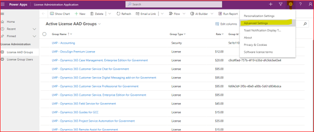
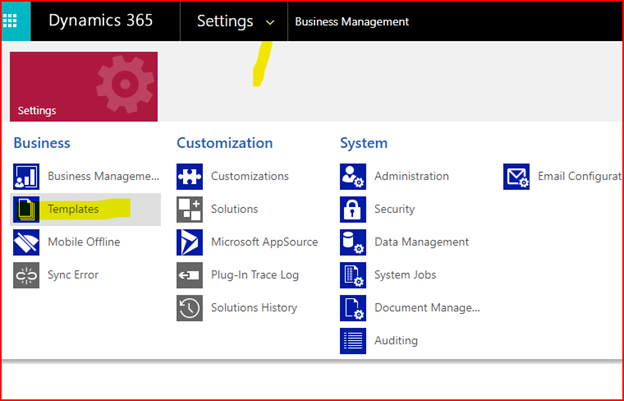
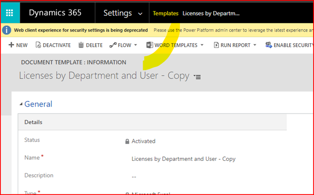
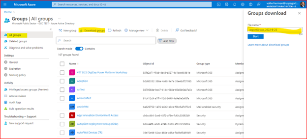
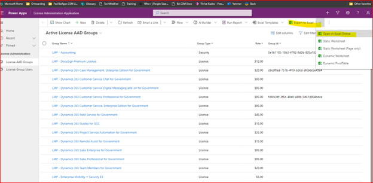
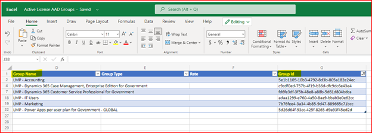
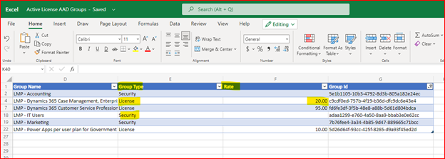
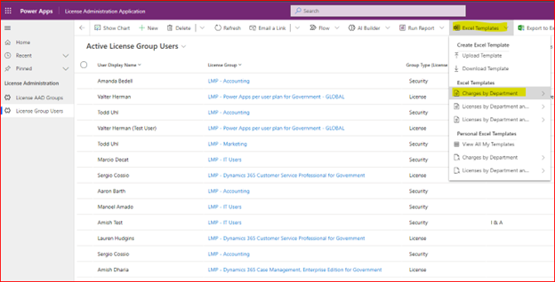
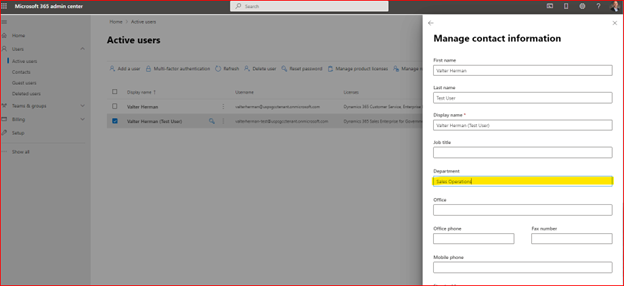

## Overview

Power Platform administrators and IT license manages overall within large organizations look for ways to efficiently manage licenses. This includes assigning, un-assigning and tracking license usage across multiple departments and various product licenses. This solution is built on top of the Power Platform and integrated with Azure Active Directory, Office 365 and Dataverse.

For a demo of the solution [view the video here.](https://www.linkedin.com/smart-links/AQHEDZZlCvv9dA)

## Security Roles Required

Due to the nature managing Azure Active Directory groups, users and licenses it is highly recommended that both the installation and running of the solution is performed by a Global Administrator.

## License Requirements

For installation and use of the solution, one of the following license types is required:

- Power Platform Per User

Note-

Power Platform Per App license do not suffice as the solution is composed of two apps.

Seeded-use rights with Office 365 E3, E5 do not suffice as the solution requires the use of Dataverse which is a premium license offering.

## Installing the Solution

### Environment

If there is an existing environment that contains the Center of Excellence toolkit then it is recommended to install this solution there. However, this solution can be installed in any environment with a Dataverse instance.

### Import Solution

1. Download the Dataverse solution from the [latest release.](https://github.com/v7herman4/License-Management-and-Charge-Back/releases/download/v1.0.0.4/LicenseManagementSolution_1_0_0_4_managed.zip)
2. In the Power Platform maker experience, navigate to the target environment and import the solution.

### Import Excel Templates

1. [Download the Excel files](https://github.com/v7herman4/License-Management-and-Charge-Back/blob/main/ExcelTemplates.zip) to be used for system templates to your local desktop.
2. Run the "License Administration Application" Model-driven app.
3. Click on the gear icon in the top right corner and click "Advanced Settings"

4. Click on Settings, Templates

5. Click on "Document Templates"
6. Click on "Upload Template"
7. Upload the file "Charges by Department.xlsx"
8. Click on "Templates" from the menu bar.

9. Repeat upload process for "Licenses by Department and User.xlsx"

### Import AAD Groups

 In order to manage the AAD Groups in the solution, you must download the list of AAD Groups from the Azure portal and upload into Dataverse tables. At this time, new and updated AAD groups must be added to the solution manually. Future releases will sync AAD and the solution.

1. In the Azure portal, download the list of AAD groups.

2. In the "License Administration App", navigate to "License AAD Groups" from the site navigation.
3. From the menu, click on "Export to Excel", "Open in Excel Online"

5. From the exported list of AAD groups Excel spreadsheet, copy the "displayName" column to the "Group Name" column in the Excel Online form. Copy the "id" column to the "Group Id" in the Excel Online form.

6. For each relevant AAD Group, in the Group column, set the Group Type. In the Rate column, set the monthly dollar rate.

7. Click "Save".
8. The import should take a few minutes. Click on "Refresh" from the menu bar to see the list of records as they are being imported.

## Using the Solution

### Managing Licenses

To assign and un-assign licenses to users, start the "License Management App" Canvas app.

1. From the "Search AD Groups" box, search on the relevant License group.
2. From the "Search O365 Users" box, type in the name of the O365 user.
3. Click on the blue arrow to add the user to the respective License AAD Group.
4. To remove users, click on the "Exit" icon from the user.

### Managing Security Groups

To add and remove users from AAD Security groups, start the "License Management App" Canvas app.

1. From the "Search AD Groups" box, search on the relevant Secruity group.
2. From the "Search O365 Users" box, type in the name of the O365 user.
3. Click on the blue arrow to add the user to the respective License AAD Group.
4. To remove users, click on the "Exit" icon from the user.

### Reporting on Chargebacks

To view charges or licenses by department, start the "License Administration" Model-driven application.

1. Navigate to "License Group Users" from the site map navigation.
2. Click on "Show Chart" from the top menu.

3. Select the appropriate system chart from the chart selector.

To report on charges or licenses by department, start the "License Administration" Model-driven application.

1. Navigate to "License Group Users" from the site map navigation.
2. Click on "Excel Templates" from the top menu.
3. Click on "Charges by Department" or "Licenses by Department".

4. Click on "Download…"

## FAQ

### Where is the Department value found for users?

In the Department value for the user in O365 portal.

